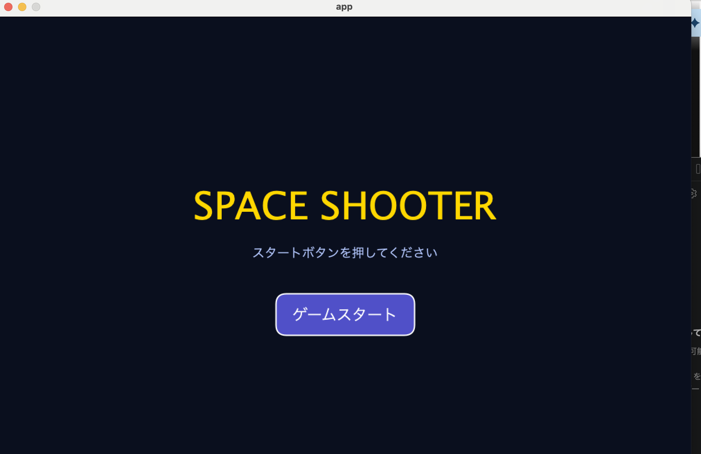
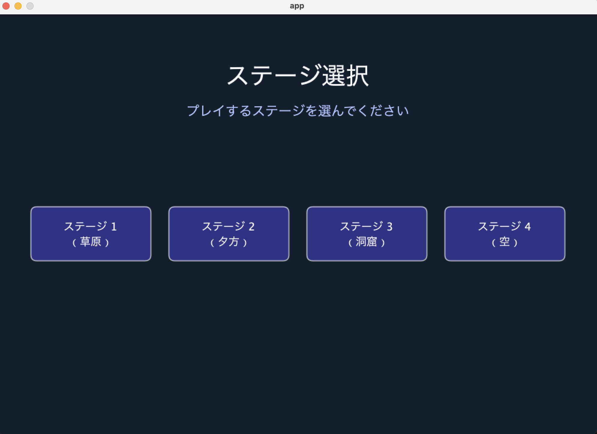
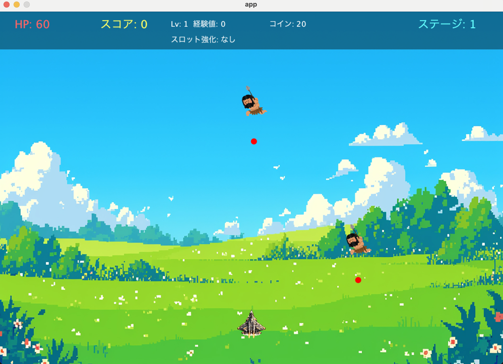
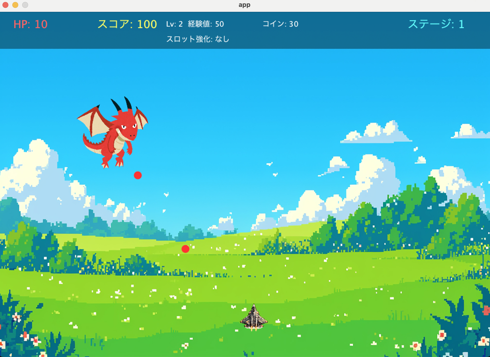
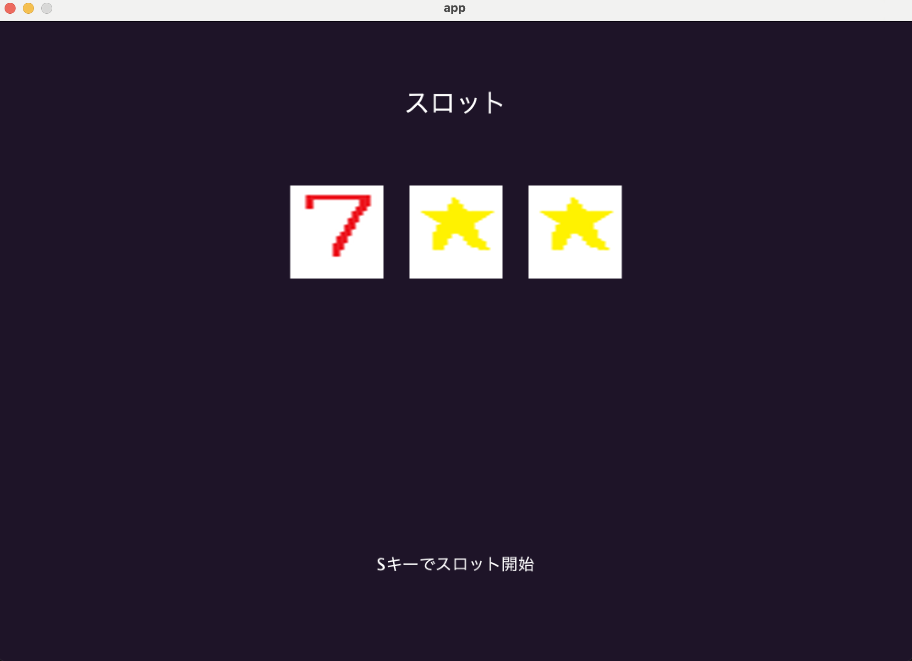
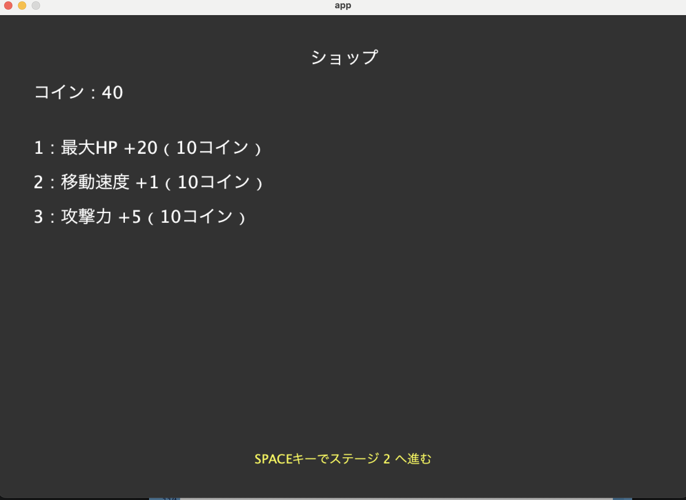

# team6
ソフトウェア工学Ⅱのための練習用リポジトリ

岡本祐菜
殿元啓太
船戸優冴
栢野悠太郎

##　シューティングゲーム
###　概要
- 左右に移動して上からくる敵を撃つ（右クリック）
- 自機が敵や障害物に当たるか、敵を逃したらゲームオーバー
- 敵からも攻撃が来てHPがなくなってもゲームオーバー
- 自分や武器を進化できる
- 敵を倒したらコインがもらえて、それでより強い武器や能力が手に入る
- ステージが進むごとに敵のレベルも上がる
- 途中で（敵を倒すと）スロットが回って当たったらランダムでいいことがある
  （HP回復、敵へのダメージ大）

##　画面
- ログイン画面
- ホーム画面
- 武器・装備変更
- レベルアップ
- プレイ画面
- クリア画面
- ゲームオーバー画面
- ステージ選択画面

#　取扱説明書
-
## 1.タイトル画面

画面中央の「ゲームスタート」をクリックするとステージ選択画面に移動します。

## 2.ステージ選択画面

ステージ1~4の中からステージをクリックすると、選んだステージ画面に遷移します。

## 3.ゲームプレイ
敵からの攻撃を避けボスを撃破せよ！

これがゲーム画面です。
画面下部中央にいるのがプレイヤーが操作する機体で、画面上部から赤い弾を放ちながら降りてくるのが「敵」です。

操作方法
→ボタン:機体が右に移動します。
←ボタン:機体が左に移動します。
spaceボタン:機体から黄色の弾が発射されます。長押しで連射ができます。

敵の赤い弾に当たらないようにこちらの黄色い弾を敵に一定数あてると敵が消滅しスコアが加算されます。「スコアが100に到達した時ボスバトルに突入します」

##　3-1.ゲームプレイ（ボスバトル）
ボスとの一騎打ち！強力な攻撃を繰り出すボスに立ち向かえ

ボスバトルに突入すると、これまで戦ったザコ敵が出現せずボスとプレイヤーの一騎打ちになります。

## 4.スロット画面
見事ボスを倒すことができたならば、スロットを回すことができ結果に応じた効果をプレイヤーは受けることができます。

一度きりの運試し！7が揃えばすごいことが起きるかも...!

操作方法
『S』キーを押すとスロットが開始！
『T』キーを押すとスロットを停止する

## 5.ショップ
スロットが終了するとショップへ移動！得られたコインで欲しい効果を購入しよう！

敵を倒してゲットしたコインをつかって能力をアップさせよう！

『1』『2』『3』それぞれ欲しい効果のキーを押そう。
効果は１度だけ購入が可能だ。

様々な効果をゲットして最終４ステージのボスの討伐を目指そう！

